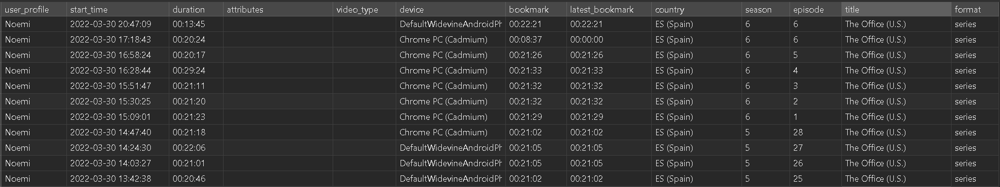
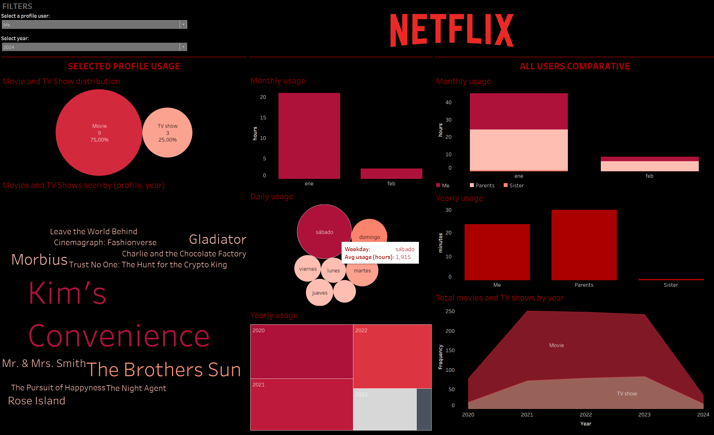

## Data availability
To download you personal Netflix data: 

- Log in to your Netflix account.
- Navigate to "Account Details" (top right).
- Proceed to "Security".
- Under "Personal info access", select "Request a copy of your personal info".
- Submit the request.
- You will receive an email notification when your download is ready.
- Download the data from the account settings page within the next 7 days.

The data is organized in a zip folder with subfolders containing various .csv files. For this project, I specifically used the "CONTENT_INTERACTION" folder, which includes a .csv of the **viewing activity**.

## Project structure
This repository contains two main files:

1. **viewingactivity_data_processing.sql**: This SQL script was employed to process data from the “viewingactivity” table. It specifically involved separating the title into individual columns for season and episode. The script encompasses several steps for data cleaning and formatting. During this process, I utilized Navicat as a database management tool in conjunction with MySQL. Additionally, I documented each step within the .sql file. Here is an example of the final result of the SQL query:

2. **viewingactivity_dashboard.twb**: This Tableau workbook (.twb) contains the visualization created using the processed data from the SQL script. The dashboard provides insights and analysis of the viewing activity data. I used different types of visualization

## Results

In the Tableau dashboard, I have visualized the usage of Netflix using various charts including pie charts, bar graphs, and word clouds. The applied filters allow for exploration based on the year and user profile (my parents, my sister, and myself).

Upon analyzing my viewing profile, it is evident that from the beginning of 2024 until the project's date, three quarters of my content consumption comprised movies, with the remaining quarter dedicated to TV series. This amounted to approximately 24 hours of viewing time over the span of two months. Saturdays emerge as the peak Netflix usage days, with an average viewing time of almost 2 hours per session. Notably, the series 'Kim's Convenience' stands out as the title I've dedicated the most time to.

Comparing profiles, it is observed that my parents have spent more time on the platform, particularly in February, indicating differences in usage patterns among different user groups.

## ¡Let's connect! 

January 2024
