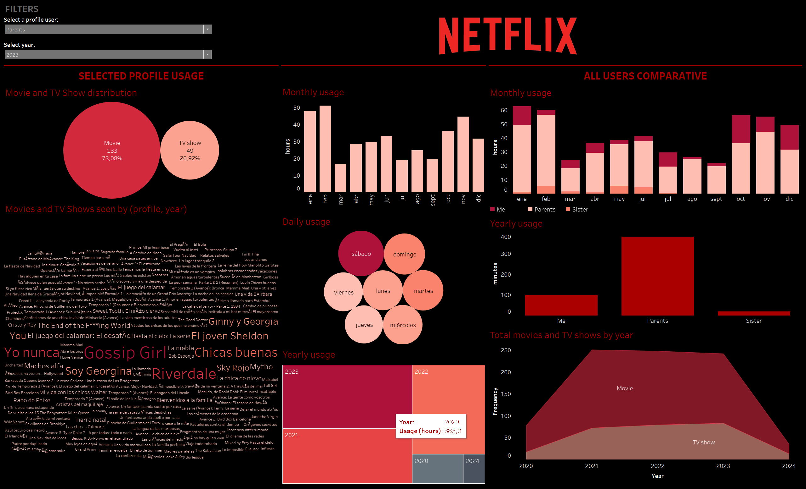

## Data availability
To download you personal Netflix data: 

- Log in to your Netflix account.
- Navigate to "Account Details" (top right).
- Proceed to "Security".
- Under "Personal info access", select "Request a copy of your personal info".
- Submit the request.
- You will receive an email notification when your download is ready.
- Download the data from the account settings page within the next 7 days.

The data will be in a zip folder containing various information. For this project, I specifically used the "Content Interaction History", which includes a record of the **viewing activity**.

## Project Structure
This repository contains two main files:

1. **viewingactivity_data_processing.sql**: This SQL script is used to process data from the "viewingactivity" table, separating the title into individual columns for season and episode. It also involves several steps for data cleaning and formatting. I used Navicat and MySQL. 

2. **viewingactivity_dashboard.twb**: This Tableau workbook (.twb) contains the visualization created using the processed data from the SQL script. The dashboard provides insights and analysis of the viewing activity data.

## Note
January 2024
